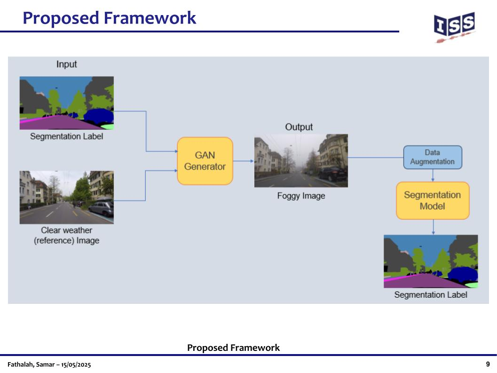
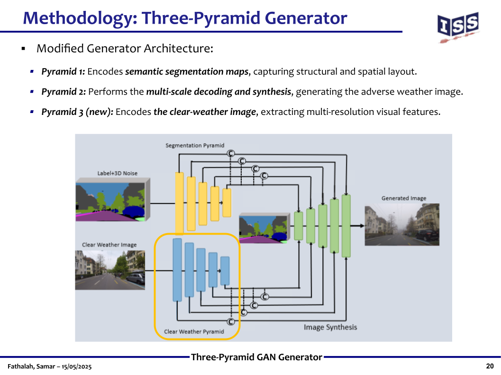
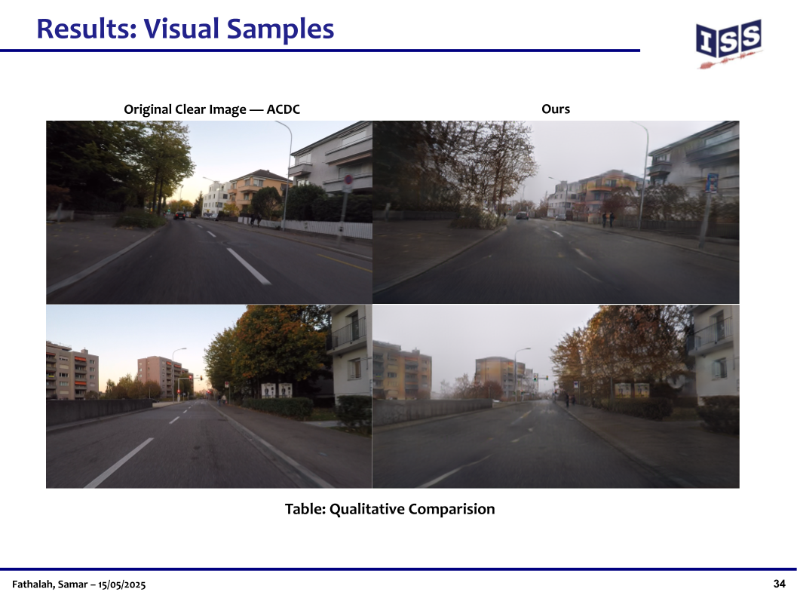

# adverse-weather-image-synthesis
Semantic-Guided GAN Framework for Generating Adverse Weather Conditions from Clear-Weather Images
# Semantic Image Synthesis under Adverse Weather Conditions
Master's Research Project · University of Stuttgart · 2025

## Problem
Semantic segmentation models degrade sharply in adverse weather — fog, rain,
snow — where real annotated training data is scarce and expensive to collect.
Synthesizing realistic adverse-weather images offers a way to close that gap.

## Approach
Extended a DP-GAN framework for semantic image synthesis, conditioning
generation on semantic segmentation maps and clear-weather reference images.
The core contribution is a novel fusion strategy: clear-weather features are
integrated through **dual SPADE normalization with a learnable fusion
mechanism**, embedded within a three-pyramid generator architecture.

## Results
Best FID score among all tested baselines: **98.01**, with superior perceptual
quality and semantic alignment. Synthesized images were validated as
augmentation data for a downstream semantic segmentation model.

## Stack
Python · PyTorch · GANs · SPADE Normalization · Semantic Segmentation · Computer Vision

📄 [Presentation slides](slides/presentation.pdf)
